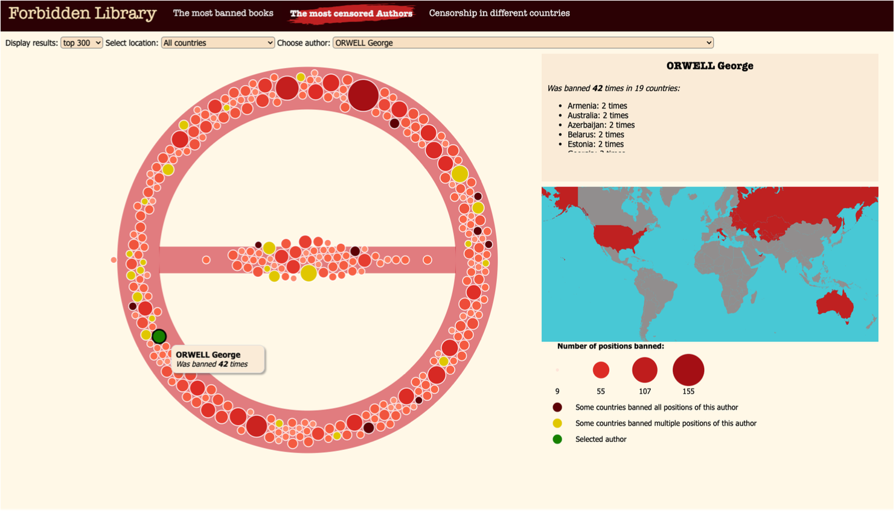

## Censorship in literature

From ancient book burnings to modern-day novel bans, censorship has existed in the world of literature for centuries. While the first recorded book ban dates back to 1517, censorship of literature persists today. In the US alone, 2,532 books were banned in 2021. Governments, religious institutions, and individuals can all seek to suppress ideas and perspectives that challenge their beliefs. Yet tracking the extent and impact of literary censorship can be a daunting task. Data on banned books is often incomplete or limited to individual countries, making it difficult to gain a comprehensive understanding of the issue.

My project is, to the best of my knowledge, the first attempt to visualise censorship in literature worldwide. The website allows users to explore which authors and books have been banned throughout history and compare censorship trends across different countries. The visualisation can be used by literature or history lovers to explore and find interesting titles to read, as well as university students who would like to search for particular authors or check the censorship in a given country over the years.

More about the data extraction and data visualisation methods is in report.pdf.
